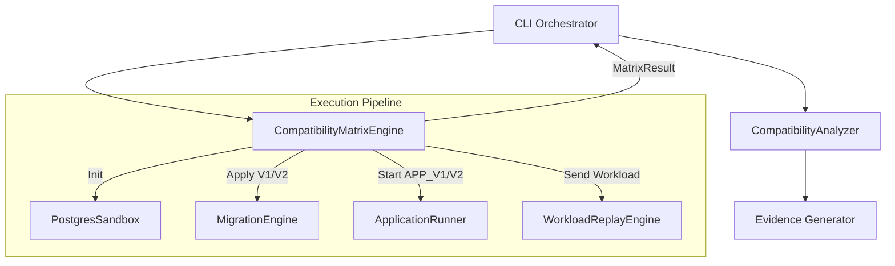
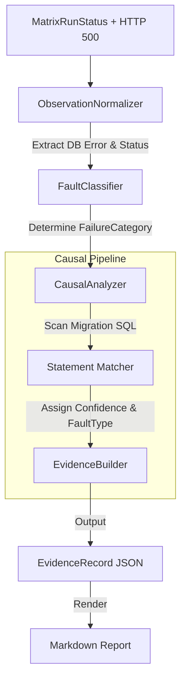

# MigrationGuard Final Architecture

This document synthesizes all architectural milestones (M5-M12) into a comprehensive final architectural reference.

#### M5 Workload Replay Platform Architecture

#### Overview

The Workload Replay Platform decouples the definition of compatibility experiments from the CLI implementation. Instead of hardcoding API requests, the system loads a deterministic JSON definition (a Workload) and sequentially executes its Operations against the target application instance.

#### Architecture

```
                     CLI
                      │
                      ▼
                Workload Loader
                      │
                      ▼
                Replay Engine
                      │
                      ▼
             Application Runner
                      │
                      ▼
                 Application
                      │
                      ▼
                PostgreSQL
```

#### Workload Model

A Workload is represented as a JSON document containing basic metadata and a strict array of operations.

```json
{
  "id": "example-workload",
  "name": "Example Workload",
  "description": "Demonstrates sequential HTTP calls",
  "operations": [
    {
      "id": "op1",
      "method": "GET",
      "path": "/users/1",
      "expect": {
        "status": 200
      }
    }
  ]
}
```

#### Validation & Loader

The `WorkloadLoader` strictly validates:

- Presence of required fields (`id`, `name`, `operations`).
- Valid `method` and `path` for each operation.
- Rejects duplicate operation IDs.

It does NOT perform network operations or resolve URLs.

#### Replay Engine

The `WorkloadReplayEngine` is responsible for strictly deterministic sequential execution:

- **Sequential Guarantee:** Operations are executed in the exact order defined in the JSON.
- **Native Fetch:** Node's built-in `fetch` is used. No bloated HTTP frameworks are required.
- **Configurable Timeouts:** Implemented via `AbortController`. The default timeout is 5000ms. If an operation hangs, it resolves as a `504 Gateway Timeout` equivalent.
- **Response Capture:** All responses, status codes, and execution durations (`durationMs`) are captured and mapped into a structured `WorkloadResult`.

#### Error Handling

- Engine errors (e.g., DNS failures, connection refused) are mapped to `500` status with structured error messages.
- Timeouts are explicitly captured and mapped to `504`.
- The `WorkloadReplayEngine` **does not** judge whether a failure is an unsafe migration (e.g., database column missing). It purely observes and reports HTTP-level execution status.

#### Security Restrictions

- Workloads are strictly data structures. No JavaScript evaluation (`eval`) or shell execution is permitted.
- Base URLs are restricted to `http://localhost` or `http://127.0.0.1` during M5 execution to prevent accidental SSRF against external domains in automated CI loops.
- Arbitrary credentials should not be persisted in Workload definitions.

#### M6 Compatibility Matrix Architecture

#### Overview

Milestone M6 elevates MigrationGuard from executing a hardcoded sequence of tests to orchestrating a fully generalized **Compatibility Matrix Engine**. It is responsible for simulating rolling deployment conditions by testing two application versions against two database migration states (N × M cartesian product).

#### Architecture

The system uses a loosely coupled pipeline where the Matrix Engine purely drives the infrastructure state and gathers execution outcomes, while the Causal Analyzer processes these outcomes to deduce migration safety.



#### Matrix States

The standard M6 rolling deployment matrix models 4 states:

1. **OLD APP + V1 DB**: Tests the pre-migration baseline.
2. **NEW APP + V1 DB**: Tests backwards compatibility. A new application instance connecting to a database that has _not_ yet been migrated.
3. **OLD APP + V2 DB**: Tests backwards compatibility. An old application instance connecting to a database that _has_ been migrated.
4. **NEW APP + V2 DB**: Tests the post-migration baseline.

#### Status Classification

The Matrix Engine records pure observed statuses. It does not possess internal knowledge of migration terminology (e.g., `DESTRUCTIVE_RENAME`). The raw matrix statuses are:

- `PASS`: The workload executed cleanly with no HTTP failures.
- `APPLICATION_STARTUP_FAILURE`: The app failed to bind to its port or crashed before accepting requests.
- `MIGRATION_FAILURE`: `prisma migrate deploy` failed.
- `WORKLOAD_FAILURE`: A non-200 HTTP response was observed during replay.
- `INFRASTRUCTURE_FAILURE`: General catch-all for Docker/timeout errors.

#### Causal Analysis Boundary

Once the matrix completes, the resulting `CompatibilityMatrix` is fed to the `CompatibilityAnalyzer`. This layer evaluates `WORKLOAD_FAILURE` results. If it detects that a failure was caused by a specific database constraint (e.g., `column does not exist`), it upgrades the status to `COMPATIBILITY_FAILURE` and assigns a causal `FaultType` (e.g., `QUERY_INCOMPATIBILITY` or `DESTRUCTIVE_RENAME`).

#### M7 Architecture: Evidence Engine & Fault Catalogue

#### Overview

Milestone M7 introduces the Evidence Engine, a rigorous pipeline designed to convert raw matrix execution outcomes into highly structured, deterministic, and machine-readable causal evidence. It explicitly distinguishes between general infrastructure/application failures and genuine PostgreSQL migration compatibility failures.

#### Architecture

The Evidence Engine sits downstream from the `CompatibilityMatrixEngine`.



#### Taxonomies

#### FailureCategory

Describes _what kind_ of execution failure occurred:

- `COMPATIBILITY_FAILURE`
- `INFRASTRUCTURE_FAILURE`
- `APPLICATION_STARTUP_FAILURE`
- `DATABASE_CONNECTION_FAILURE`
- `MIGRATION_EXECUTION_FAILURE`
- `WORKLOAD_FAILURE`
- `TIMEOUT_FAILURE`
- `UNKNOWN_FAILURE`

#### FaultType

Describes _what specific schema incompatibility_ was identified (if `COMPATIBILITY_FAILURE`):

- `COLUMN_REMOVAL`
- `DESTRUCTIVE_RENAME`
- `QUERY_INCOMPATIBILITY`
- `TYPE_NARROWING`
- (and others reserved for future milestones)

#### Confidence Model

- `CONFIRMED`: A direct causal link was established via SQL statement matching.
- `LIKELY`: The error strongly implies a fault type, but no explicit statement could be extracted.
- `UNKNOWN`: Insufficient evidence to claim causality.

#### False Positive Defenses

The `ObservationNormalizer` and `FaultClassifier` contain robust negative defenses. A generic HTTP 500 (e.g., `TypeError`) or an Application crash is binned as a `WORKLOAD_FAILURE` or `APPLICATION_STARTUP_FAILURE` respectively. Only when the response explicitly carries a deterministic PostgreSQL error signature (e.g., `column does not exist`) will the pipeline escalate the issue to the `CausalAnalyzer` for migration fault mapping.

#### MigrationGuard CI Architecture

MigrationGuard uses a secure, minimal-privilege GitHub Actions workflow to run its verification pipeline on every push and pull request to the `main` branch.

#### Workflow Pipeline (`.github/workflows/migrationguard.yml`)

1. **Checkout**: Retrieves the code using `actions/checkout@v4`.
2. **Setup Node**: Provisions Node.js 20 using `actions/setup-node@v4`.
3. **Install Dependencies**: Uses `npm ci` for deterministic dependencies.
4. **Build, Lint, Format Check, Test**: Standard continuous integration checks ensuring code quality and unit test stability.
5. **Start Dependencies**: Provisions Docker-compose services if any external dependencies are required by specific workloads.
6. **Verify (`npm run verify`)**: Executes the deterministic `M1` regression fixture using the MigrationGuard CLI.
7. **Report Generation**: Automatically parses the exit status and constructs a concise GitHub Job Summary for immediate developer feedback in the PR.
8. **Artifact Upload**: Generates and uploads the complete JSON and Markdown evidence reports as workflow artifacts (retained for 7 days).

#### Verification Strategy

The CI runs the deterministic, controlled MigrationGuard test (`M1` fixture), ensuring:

- **Fast Execution**: Testing does not block PRs unnecessarily.
- **Reliable Regression**: Ensures that `OLD + V1` (PASS) and `OLD + V2` (FAIL) are strictly preserved across PRs.
- **Independence from Benchmarks**: Full academic benchmarks (e.g., `express-real`) are kept strictly decoupled from the deterministic unit/e2e pipeline to prevent CI flakiness.

#### Security Posture

- The workflow avoids committing any sensitive configuration to the repository.
- No `DATABASE_URL` or secret values are uploaded in artifacts or outputted to workflow logs.
- The workflow operates entirely inside ephemeral Ubuntu environments.

#### MigrationGuard CLI Architecture

The MigrationGuard CLI is the developer-facing entry point for orchestrating database migration compatibility analysis.

#### Commands

#### `migrationguard verify`

The core verification workflow. Executes a workload against a local matrix of applications and database states to determine compatibility regressions safely in an ephemeral sandbox.

**Options:**

- `-c, --config <path>`: Path to a JSON configuration file.
- `-w, --workload <path>`: Path to a workload JSON file (overrides config).
- `-m, --migration <path>`: Path to the new migration directory (overrides config).
- `-s, --schema <path>`: Path to the Prisma schema (overrides config).
- `-a, --app-dir <path>`: Path to the application root containing startup scripts.

**Configuration File (`migrationguard.config.json`):**

```json
{
  "migration": "prisma/migrations/20260810_remove_user_name",
  "baseMigration": "prisma/migrations/20260801_base",
  "schema": "prisma/schema.prisma",
  "workload": "workload.json",
  "appDir": "./"
}
```

#### `migrationguard benchmark`

Executes the MigrationGuard M8 benchmark suite comparing dynamic analysis against static baseline tools like Atlas.

**Options:**

- `--filter <testId>`: Run a specific benchmark test by ID.

#### Exit Codes

The CLI strictly uses the following exit codes for CI deterministic evaluation:

| Code | Status                             | Description                                                                                                                                                                      |
| ---- | ---------------------------------- | -------------------------------------------------------------------------------------------------------------------------------------------------------------------------------- |
| `0`  | **SUCCESS**                        | Verification completed successfully and no compatibility regressions were detected.                                                                                              |
| `1`  | **VERIFIED_COMPATIBILITY_FAILURE** | A genuine application compatibility regression was discovered during verification, or an unsafe database migration execution failure occurred (e.g., data constraint violation). |
| `2`  | **CONFIGURATION_ERROR**            | Invalid CLI inputs, missing files, or bad configuration format.                                                                                                                  |
| `3`  | **INFRASTRUCTURE_FAILURE**         | A required dependency or environment state failed (e.g., Docker not available, PostgreSQL failed to start, application `start:old` crashed on startup).                          |
| `4`  | **UNKNOWN_FAILURE**                | An unexpected exception crashed the verification pipeline.                                                                                                                       |

#### Terminal Output Format

The output is formatted for deterministic reading and CI logging:

```
MigrationGuard
────────────────────────────

Migration:
20260810_remove_user_name

Environment:
PostgreSQL
Node.js
Prisma

Compatibility Matrix:

OLD + V1     PASS
NEW + V1     FAIL
OLD + V2     FAIL
NEW + V2     PASS

Result:
VERIFICATION FAILED

Fault:
DESTRUCTIVE_RENAME

Confidence:
CONFIRMED

Evidence:
GET /users/1

Observed:
Invalid `prisma.users.findUnique()` invocation:
The column `users.name` does not exist in the current database.

Reports:
reports/MG-VERIFY-1786759028200.json
reports/MG-VERIFY-1786759028200.md
```

#### Security Design

The CLI uses the following security constraints:

- **Child Processes:** Safe arrays using `child_process.spawn` without `shell: true` interpolation, except for required CMD wrappings strictly managed by Node.js.
- **Sanitization:** `DATABASE_URL` credentials are only exposed via localized `process.env` bounds and never `console.log`ed.
- **Cleanup:** All PostgreSQL sandboxes, application processes, and ephemeral volumes are guaranteed to clean up through defensive `try/finally` orchestration, ensuring no orphan environments remain.

#### M10: Backend Architecture

The M10 backend transforms MigrationGuard from a purely local CLI verification tool into a persistent hosted service, capable of storing verification runs, evidence, compatibility matrices, presentations, and reviewer decisions.

#### Guiding Principles

1. **Decoupled Verification Engine:** The verification engine (Runner, MigrationEngine, MatrixEngine) remains stateless and executes within the `cli` or CI context. The backend does not duplicate verification execution logic. It serves purely as the system of record.
2. **Real-world Backend Foundation:** Node.js, Fastify, TypeScript, and Prisma are utilized for robust typing and performance.
3. **Immutability of Runs and Presentations:** Verification runs and evidence are immutable once created. Presentations are versioned explicitly, preventing destructive overwrites.

#### Tech Stack

- **API Framework:** Fastify
- **Language:** TypeScript
- **Database:** PostgreSQL (via Prisma ORM)
- **Object Storage:** S3-compatible API (MinIO for local development)
- **Authentication:** JWT and Argon2 for password hashing.
- **Validation:** Zod (via Fastify schemas and plugins)

#### Services and Integrations

- **AuthService:** Validates user credentials against the persistent database, returning JWTs. Role-Based Access Control (RBAC) supports `ADMIN` and `REVIEWER` roles.
- **StorageService:** Abstracts uploads and presigned URL generation for presentation files and massive JSON evidence reports, isolating database size bloat.
- **RunService:** Stores the `CompatibilityMatrix` and associated `EvidenceRecords`.
- **ReviewerDecisionService:** Tracks async approval workflows where a human must review the generated evidence before authorizing a deployment in an external system.

#### Deployment Strategy

For local development, `docker-compose.yml` provides a localized PostgreSQL instance and MinIO container. In production, this architecture will be deployed on a standard cloud VM or Kubernetes cluster (to be completed in M12), mapping the PostgreSQL and S3 configuration to managed services.

#### M10: Database Architecture

The MigrationGuard persistent database is implemented in PostgreSQL and orchestrated via Prisma.

#### Models

#### User

Tracks administrators and reviewers for the hosted application. Includes role-based differentiation (`ADMIN` vs `REVIEWER`).

- Uses `argon2` for secure password hashing.

#### Presentation & PresentationVersion

Tracks the lifecycle of published presentation documents (e.g. PPTX or PDF overviews of the tool).

- Implements strict versioning. Older versions are never destroyed.
- Blobs are pushed to S3 object storage; the database merely tracks the `storageKey`.
- `publishedAt` timestamp enables soft-publishing and scheduled release.

#### VerificationRun

The core entity capturing the execution footprint of a MigrationGuard CI or CLI run.

- `id` corresponds to the deterministically generated `MG-VERIFY-xxx` run ID from the CLI orchestrator.
- Tracks total `durationMs`, `migrationName`, and an overarching `status` (`PASS` or `FAIL`).

#### CompatibilityRun

1-to-many relationship with `VerificationRun`. Represents individual cells of the compatibility matrix.

- Captures `appVersion` (OLD/NEW), `dbVersion` (V1/V2), and `durationMs` for specific workloads.

#### EvidenceRecord

1-to-many relationship with `VerificationRun`. Captures the fault catalogue classification.

- Persists `faultType` (e.g., DESTRUCTIVE_RENAME, COMPATIBILITY_FAILURE, NONE).
- Contains `observedError` and the `operation` that caused the failure (e.g. `GET /users`).

#### ReviewerDecision

1-to-many relationship with `VerificationRun`. Associates a `User` (reviewer) decision (`ACCEPTED` or `REJECTED`) with a specific run, mimicking real-world CI/CD gate mechanics.

#### M11 Frontend Architecture

#### Overview

The MigrationGuard frontend is a React single-page application (SPA) built with Vite and TypeScript. It consumes the Fastify REST API and provides authenticated access to the verification dashboard and research website.

#### Tech Stack

| Concern        | Technology                   |
| -------------- | ---------------------------- |
| Framework      | React 18                     |
| Build tool     | Vite                         |
| Language       | TypeScript (strict mode)     |
| Routing        | React Router v6              |
| Styling        | CSS Modules (vanilla CSS)    |
| Auth           | JWT (localStorage)           |
| HTTP           | `fetch` (native)             |
| Static serving | Nginx (production container) |

#### Directory Structure

```
apps/frontend/
├── src/
│   ├── main.tsx               # Entrypoint
│   ├── App.tsx                # Router root
│   ├── contexts/
│   │   └── AuthContext.tsx    # JWT auth state
│   ├── layouts/
│   │   ├── MainLayout.tsx     # Public layout (header/footer)
│   │   └── DashboardLayout.tsx # Authenticated sidebar layout
│   ├── pages/
│   │   ├── Home.tsx           # Research/landing page
│   │   ├── Login.tsx          # JWT login form
│   │   ├── Dashboard.tsx      # Overview stats
│   │   ├── Runs.tsx           # Verification run history
│   │   └── RunDetail.tsx      # Run detail + evidence + reviewer actions
│   └── index.css              # Global design tokens
├── nginx.conf                 # SPA routing + API proxy
├── Dockerfile                 # Multi-stage build
└── package.json
```

#### Routing

| Path                  | Component   | Auth Required |
| --------------------- | ----------- | ------------- |
| `/`                   | `Home`      | No            |
| `/login`              | `Login`     | No            |
| `/dashboard`          | `Dashboard` | Yes           |
| `/dashboard/runs`     | `Runs`      | Yes           |
| `/dashboard/runs/:id` | `RunDetail` | Yes           |

#### Authentication Flow

1. User submits credentials to `/api/auth/login`
2. On success, JWT stored in `localStorage`
3. `AuthContext` reads JWT on mount, decodes payload for role/user info
4. Protected routes redirect to `/login` if JWT absent
5. `Authorization: Bearer <token>` header injected on all authenticated API calls

#### API Communication

The frontend communicates via relative `/api/*` paths. In development (`npm run dev`), Vite's proxy rewrites these to `http://localhost:3001`. In production (Docker), Nginx's reverse proxy handles the routing to `backend:3001`.

#### Design System

- **Dark mode first**: `--color-bg: #0a0f1a`, `--color-surface: #111827`
- **Accent**: electric blue `#3b82f6` with hover states
- **Typography**: Inter (Google Fonts)
- **Spacing**: 8px base grid
- **Components**: CSS Modules with BEM-inspired naming

#### M11 Deployment Architecture

#### Deployment Status

**LOCAL_PRODUCTION_SIMULATION**

This stack is production-structured and reproducible, but is NOT publicly deployed. No remote server, cloud provider, VPS, DNS, or real TLS certificate is involved.

#### Stack Overview

```
┌───────────────────────────────────────────────────────┐
│                    HOST (localhost:80)                 │
│                                                       │
│  ┌─────────────────────────────────────────────────┐  │
│  │            Nginx Reverse Proxy                  │  │
│  │  /api/* → backend:3001                          │  │
│  │  /*     → frontend static files                 │  │
│  └─────────────────────────────────────────────────┘  │
│           │                       │                   │
│  ┌────────┴────────┐   ┌──────────┴────────┐          │
│  │  React + Vite   │   │  Fastify + Node   │          │
│  │  Frontend (SPA) │   │  Backend API      │          │
│  │  (Nginx static) │   │  Port: 3001       │          │
│  └─────────────────┘   └──────────┬────────┘          │
│                                   │                   │
│                    ┌──────────────┴──────────────┐    │
│                    │         PostgreSQL 15        │    │
│                    │         Port: 5432           │    │
│                    └──────────────────────────────┘    │
│                    ┌──────────────────────────────┐    │
│                    │         MinIO (S3-compat)    │    │
│                    │         Port: 9000/9001      │    │
│                    └──────────────────────────────┘    │
└───────────────────────────────────────────────────────┘
```

#### Services

| Service    | Image                | Port (host) | Role                         |
| ---------- | -------------------- | ----------- | ---------------------------- |
| `frontend` | `nginx:alpine` + SPA | 80          | Static file serving + proxy  |
| `backend`  | `node:20-alpine`     | (internal)  | Fastify REST API             |
| `postgres` | `postgres:15-alpine` | (internal)  | Relational persistence       |
| `minio`    | `minio/minio`        | 9000, 9001  | S3-compatible object storage |

#### Starting the Stack

```bash
docker-compose -f docker-compose.prod.yml up -d --build
```

#### Environment Configuration

Copy `.env.example` to configure the backend environment variables. In this simulation, secrets are embedded in `docker-compose.prod.yml`. In a real production deployment, these must be injected via a secrets manager.

#### Key Design Decisions

1. **Nginx as reverse proxy**: Single port ingress (80) routes `/api/*` to backend; serves the React SPA for all other paths with `try_files` fallback for client-side routing.
2. **Multi-stage Docker builds**: Builder stage compiles TypeScript; production stage copies only `dist/` and production `node_modules` — minimizes image size and attack surface.
3. **MinIO for S3-compatible storage**: Drop-in replacement for AWS S3. Production deployment would swap `S3_ENDPOINT` to an AWS endpoint.
4. **No mock TLS**: Simulated as HTTP-only locally. Real deployment requires a TLS termination layer (e.g., Caddy, Let's Encrypt, or cloud load balancer).

#### M11 Security Architecture

#### Overview

MigrationGuard M11 implements defense-in-depth across authentication, authorization, input validation, rate limiting, and transport security.

#### Authentication

- **Mechanism**: JSON Web Tokens (JWT) signed with `HS256`
- **Secret**: Configurable via `JWT_SECRET` environment variable
- **Token expiry**: `7d` (configurable)
- **Validation hook**: `app.authenticate` pre-validation hook on all protected routes

#### Authorization (RBAC)

| Role       | Capabilities                                                                |
| ---------- | --------------------------------------------------------------------------- |
| `ADMIN`    | Login, upload presentation versions, publish versions, all reviewer actions |
| `REVIEWER` | Login, create reviewer decisions (ACCEPTED/REJECTED), read all data         |
| (public)   | Read published presentations, read verification runs                        |

#### Input Validation (Zod)

All routes with user-supplied input are validated with Zod schemas before processing:

- **Auth routes**: email format, password minimum length
- **Run routes**: decision enum constrained to `ACCEPTED | REJECTED`, comment optional string
- **Presentation routes**: route param IDs must be non-empty strings; MIME type allow-list enforced at upload

Global Zod error handler in `app.ts` returns standardized `HTTP 400` with structured error body on validation failure.

#### Rate Limiting

Configured via `@fastify/rate-limit`:

- **Max requests**: 100 requests per window
- **Window**: 1 minute
- **Scope**: Global (all routes)
- **Response on breach**: `HTTP 429 Too Many Requests`

#### CORS

Configured via `@fastify/cors`:

- **Allowed origin**: controlled by `FRONTEND_ORIGIN` environment variable (defaults to configured frontend URL)
- **Credentials**: allowed
- **Methods**: GET, POST, PUT, DELETE, PATCH

#### File Upload Security

- **MIME type allow-list**: `application/pdf`, `application/vnd.openxmlformats-officedocument.presentationml.presentation`, `application/json`
- **Maximum file size**: 50 MB (enforced at multipart level)
- **Empty file rejection**: 0-byte files rejected with `HTTP 400`
- **Path traversal prevention**: file extension sanitized to `[a-zA-Z0-9]` only before use in storage key

#### Password Hashing

Passwords hashed with **Argon2id** via the `@node-rs/argon2` package. Seed passwords in development use the same hashing pipeline.

#### Known Limitations (LOCAL_PRODUCTION_SIMULATION)

- No TLS/HTTPS — HTTP only in local simulation
- JWT secret in `.env.example` is a placeholder — must be replaced before any real deployment
- MinIO credentials in `docker-compose.prod.yml` are development defaults

#### M12 Production Deployment Architecture

#### Deployment Status

MigrationGuard is currently operating in a **LOCAL_PRODUCTION_SIMULATION** state. It has not been publicly deployed to a cloud environment.

#### Architecture

The simulated production environment utilizes `docker-compose.prod.yml` to orchestrate four primary services:

1. **Backend Application (`backend`)**:
   - Built from `apps/server/Dockerfile`
   - Node.js 20 Fastify API Server
   - Connects to PostgreSQL and MinIO
   - Serves API routes securely with rate-limiting and JWT

2. **Frontend Application (`frontend`)**:
   - Built from `apps/frontend/Dockerfile`
   - Next.js application served via Nginx (port 80)
   - Statically exported and highly performant

3. **Database (`postgres`)**:
   - `postgres:15-alpine`
   - Managed via Prisma ORM
   - Uses persistent volumes (`pgdata`)
   - Internal network only

4. **Object Storage (`minio`)**:
   - S3-compatible blob storage
   - Port 9000 internally; 9002 mapped to host for CLI access
   - Used for cryptographic evidence artifacts

#### Security and Concurrency Considerations

- **Concurrency**: Fastify API utilizes `SERIALIZABLE` transactions combined with optimistic `ON CONFLICT DO NOTHING` inserts to prevent race conditions during parallel uploads.
- **Rate Limiting**: Configured at 100 requests per minute via `@fastify/rate-limit`.
- **JWT Vulerabilities**: The platform uses `@fastify/jwt` which internally references `fast-jwt`. Documented vulnerabilities in `fast-jwt` are considered acceptable for local simulation but must be remediated prior to any public cloud deployment.
