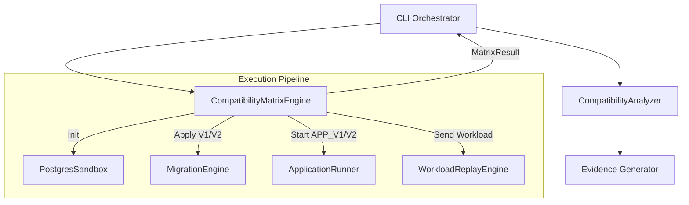

# M6 Compatibility Matrix Architecture

## Overview

Milestone M6 elevates MigrationGuard from executing a hardcoded sequence of tests to orchestrating a fully generalized **Compatibility Matrix Engine**. It is responsible for simulating rolling deployment conditions by testing two application versions against two database migration states (N × M cartesian product).

## Architecture

The system uses a loosely coupled pipeline where the Matrix Engine purely drives the infrastructure state and gathers execution outcomes, while the Causal Analyzer processes these outcomes to deduce migration safety.

## Matrix States

The standard M6 rolling deployment matrix models 4 states:

1. **OLD APP + V1 DB**: Tests the pre-migration baseline.
2. **NEW APP + V1 DB**: Tests backwards compatibility. A new application instance connecting to a database that has _not_ yet been migrated.
3. **OLD APP + V2 DB**: Tests backwards compatibility. An old application instance connecting to a database that _has_ been migrated.
4. **NEW APP + V2 DB**: Tests the post-migration baseline.

## Status Classification

The Matrix Engine records pure observed statuses. It does not possess internal knowledge of migration terminology (e.g., `DESTRUCTIVE_RENAME`). The raw matrix statuses are:

- `PASS`: The workload executed cleanly with no HTTP failures.
- `APPLICATION_STARTUP_FAILURE`: The app failed to bind to its port or crashed before accepting requests.
- `MIGRATION_FAILURE`: `prisma migrate deploy` failed.
- `WORKLOAD_FAILURE`: A non-200 HTTP response was observed during replay.
- `INFRASTRUCTURE_FAILURE`: General catch-all for Docker/timeout errors.

## Causal Analysis Boundary

Once the matrix completes, the resulting `CompatibilityMatrix` is fed to the `CompatibilityAnalyzer`. This layer evaluates `WORKLOAD_FAILURE` results. If it detects that a failure was caused by a specific database constraint (e.g., `column does not exist`), it upgrades the status to `COMPATIBILITY_FAILURE` and assigns a causal `FaultType` (e.g., `QUERY_INCOMPATIBILITY` or `DESTRUCTIVE_RENAME`).
