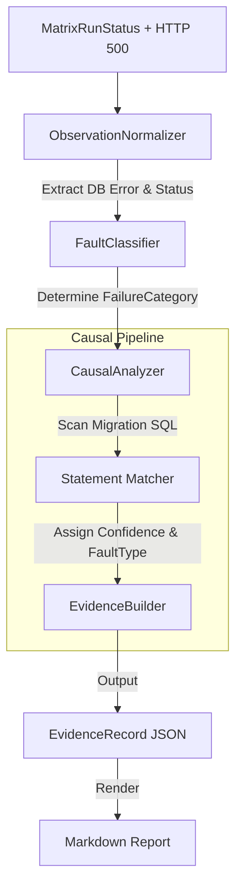

# M7 Architecture: Evidence Engine & Fault Catalogue

## Overview

Milestone M7 introduces the Evidence Engine, a rigorous pipeline designed to convert raw matrix execution outcomes into highly structured, deterministic, and machine-readable causal evidence. It explicitly distinguishes between general infrastructure/application failures and genuine PostgreSQL migration compatibility failures.

## Architecture

The Evidence Engine sits downstream from the `CompatibilityMatrixEngine`.

## Taxonomies

### FailureCategory

Describes _what kind_ of execution failure occurred:

- `COMPATIBILITY_FAILURE`
- `INFRASTRUCTURE_FAILURE`
- `APPLICATION_STARTUP_FAILURE`
- `DATABASE_CONNECTION_FAILURE`
- `MIGRATION_EXECUTION_FAILURE`
- `WORKLOAD_FAILURE`
- `TIMEOUT_FAILURE`
- `UNKNOWN_FAILURE`

### FaultType

Describes _what specific schema incompatibility_ was identified (if `COMPATIBILITY_FAILURE`):

- `COLUMN_REMOVAL`
- `DESTRUCTIVE_RENAME`
- `QUERY_INCOMPATIBILITY`
- `TYPE_NARROWING`
- (and others reserved for future milestones)

### Confidence Model

- `CONFIRMED`: A direct causal link was established via SQL statement matching.
- `LIKELY`: The error strongly implies a fault type, but no explicit statement could be extracted.
- `UNKNOWN`: Insufficient evidence to claim causality.

## False Positive Defenses

The `ObservationNormalizer` and `FaultClassifier` contain robust negative defenses. A generic HTTP 500 (e.g., `TypeError`) or an Application crash is binned as a `WORKLOAD_FAILURE` or `APPLICATION_STARTUP_FAILURE` respectively. Only when the response explicitly carries a deterministic PostgreSQL error signature (e.g., `column does not exist`) will the pipeline escalate the issue to the `CausalAnalyzer` for migration fault mapping.
